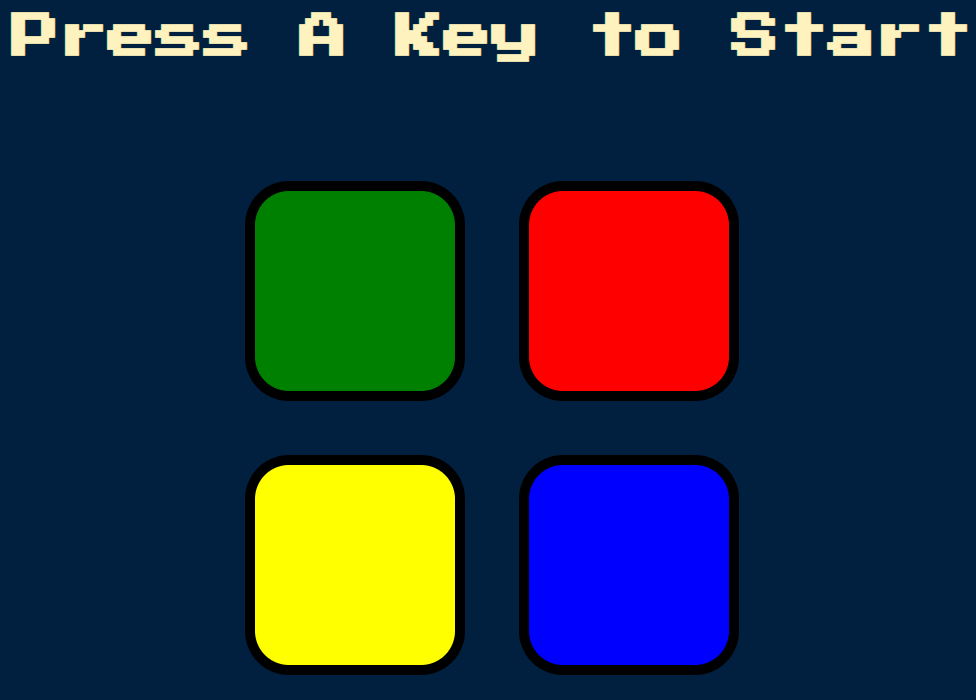

# Simon Game

## Overview
The Simon Game is a browser-based implementation of the classic electronic memory game. Players are challenged to repeat increasingly complex sequences of colors presented by the game. This repository contains the source code, assets, and sounds required to run the Simon Game web application.

 <!-- Add a preview image of the game here -->

## Features
- Intuitive user interface.
- Dynamic gameplay with increasing difficulty levels.
- Responsive design for a seamless experience across devices.
- Audio feedback for engaging gameplay.
- Fully customizable styling with CSS.

## Files
- `index.html`: Main HTML file defining the structure of the game interface.
- `styles.css`: Cascading Style Sheets defining the visual presentation of the game interface.
- `game.js`: JavaScript file implementing the game logic and interactivity.

## Installation
To run the Simon Game locally, follow these steps:
1. Clone this repository to your local machine.
2. Open the `index.html` file in a modern web browser.
3. Press any key to start the game and enjoy!

## Usage
- Upon starting the game, the player is presented with a sequence of colored buttons.
- The player must repeat the sequence by clicking the buttons in the correct order.
- With each successful repetition, the game presents a longer sequence, increasing the challenge.
- If the player makes a mistake, the game ends, and the player can restart by pressing any key.

## Sounds
The following sounds are included for the game keys:
- `red.mp3`: Sound for the red key.
- `blue.mp3`: Sound for the blue key.
- `green.mp3`: Sound for the green key.
- `yellow.mp3`: Sound for the yellow key.

## Interactive Features
- Add an option to customize game difficulty.
- Implement a high-score system to track players' achievements.
- Include a leaderboard to display top scores.
- Integrate social media sharing buttons for players to share their scores.

## Contributing
Contributions to the Simon Game project are welcome! If you encounter any bugs, have suggestions for improvements, or wish to contribute new features, please follow these steps:
1. Fork the repository.
2. Create a new branch for your feature or bug fix.
3. Make your changes and ensure they pass all tests.
4. Submit a pull request, describing the changes made and any relevant information.

## License
This project is licensed under the MIT License. See the [LICENSE](LICENSE) file for details.

## Credits
The Simon Game project is developed and maintained by Seshan S. Special thanks to the original creators and contributors of the Simon Game concept and its various implementations.
